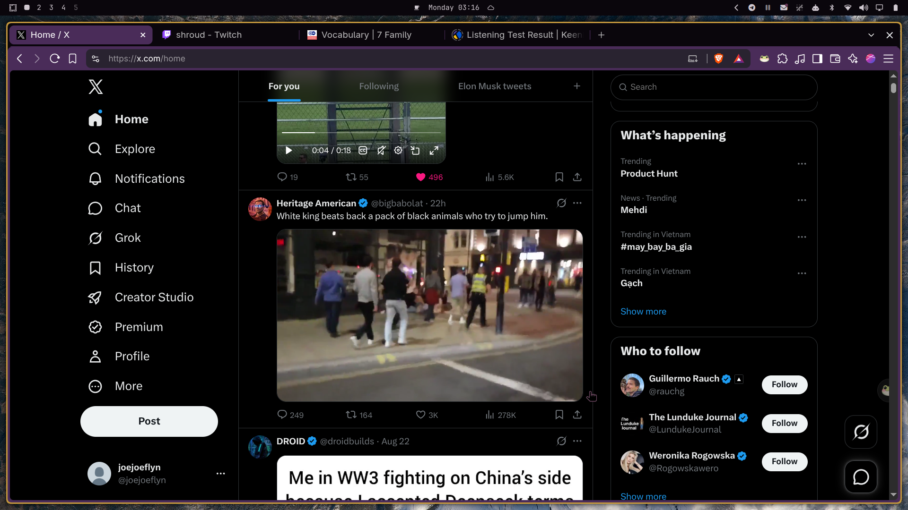

# Timeline — Omarchy Theme ⏰

A **dynamic** desktop theme for [Omarchy](https://omarchy.org/) that shifts colors and wallpapers throughout the day — inspired by Apple's dynamic themes, built for Omarchy.

8 time phases cycle automatically from warm sunrise to deep midnight:

| Phase | Time | Palette | Background |
| :--- | :--- | :--- | :--- |
| 🌅 Sunrise | 5:00–7:00 | Soft pink/orange | Mt Fuji sunrise |
| ☀️ Morning | 7:00–10:00 | Golden warm | Mt Fuji golden morning |
| 🏜️ Noon | 10:00–13:00 | Bright warm light | Mt Fuji from Lake Yamanaka |
| 🌇 Afternoon | 13:00–16:00 | Deep warm | Mt Fuji from ISS |
| 🔥 Sunset | 16:00–19:00 | Orange/red dramatic | Mt Fuji sunset |
| 🌆 Dusk | 19:00–21:00 | Purple/orange transition | Mt Fuji silhouette dusk |
| 🌙 Night | 21:00–24:00 | Dark warm deep | Mt Fuji at night Kawaguchiko |
| 🌑 Midnight | 0:00–5:00 | Darkest warm black | Fuji City lights from Mt Fuji |



---

## 🎨 How It Works

The `timeline-daemon.sh` script runs every 30 minutes via a systemd user timer. It checks the current time, picks the matching phase, and swaps `colors.toml` and the active background. Omarchy then refreshes the theme colors live — borders, btop, neovim, and more.

No restart needed. The colors shift gradually as the day progresses.

---

## 📦 What's Included

- `colors.toml` — Active palette (overwritten by daemon based on time)
- `colors-{phase}.toml` — 8 phase palettes (sunrise, morning, noon, afternoon, sunset, dusk, night, midnight)
- `hyprland.lua` — Warm active window borders with rounded corners and soft shadows
- `backgrounds/` — 8 desert landscape photos, one per time phase
- `timeline-daemon.sh` — Time-based color and background switcher
- `systemd/` — systemd user service and timer (runs every 30 min)
- `icons.theme` — Set to `Yaru-yellow` for warm folder icons
- `unlock.png` & `preview-unlock.png` — Desert sunset for Plymouth boot and lock screens
- `preview.png` — 1920x1080 theme switcher preview
- `btop.theme` — Color-matched btop process monitor theme
- `neovim.lua` — Aether.nvim colorscheme tuned to the timeline palette
- `vscode.json` — VS Code color theme integration

---

## 🚀 Installation

### Option 1: Via Omarchy CLI
```bash
omarchy theme install https://github.com/JoeJoeflyn/omarchy-timeline-theme
```

### Option 2: Apply Manually
```bash
omarchy theme set timeline
```

### Enable the auto-switching daemon:
```bash
# Install the systemd timer
cp ~/.config/omarchy/themes/timeline/systemd/timeline-daemon.service ~/.config/systemd/user/
cp ~/.config/omarchy/themes/timeline/systemd/timeline-daemon.timer ~/.config/systemd/user/
systemctl --user daemon-reload
systemctl --user enable --now timeline-daemon.timer
```

The daemon will now run every 30 minutes and shift the theme automatically.

---

## 📄 License
MIT
